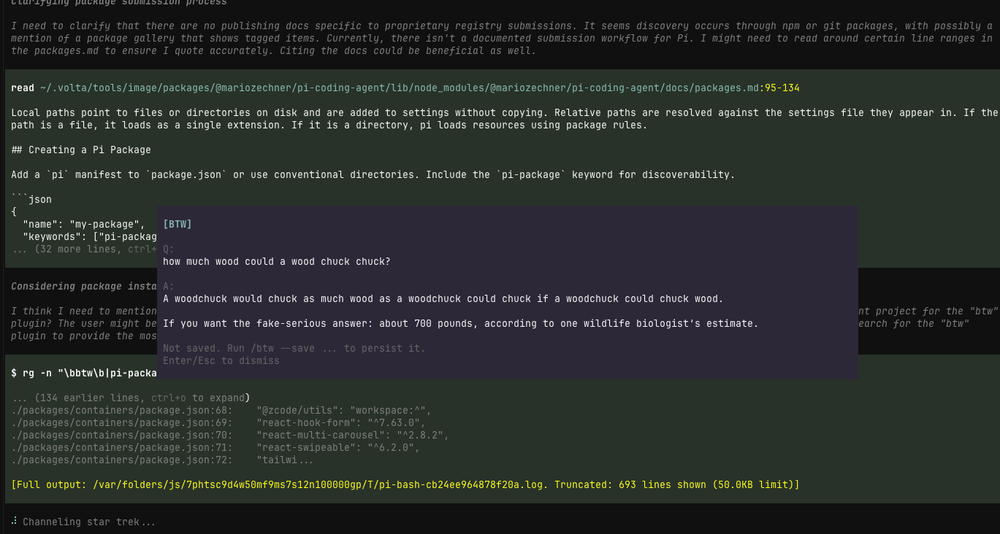

# pi-btw

A small [pi](https://github.com/badlogic/pi-mono) extension that adds a `/btw` command for side questions.

`/btw` runs immediately, even while the main agent is still busy.



## What it does

- asks a one-off side question using the current session context
- returns an answer immediately in an overlay
- does **not** disturb the running agent
- does **not** save anything by default
- optionally saves the result into the session with `--save`

Saved BTW notes are visible in the session transcript, but excluded from future LLM context.

## Install

### From npm (after publish)

```bash
pi install npm:pi-btw
```

### From git

```bash
pi install git:github.com/dbachelder/pi-btw
```

Then reload pi:

```text
/reload
```

### From a local checkout

```bash
pi install /absolute/path/to/pi-btw
```

## Usage

```text
/btw what file defines this route?
/btw --save what file defines this route?
/btw -s summarize the last error in one sentence
```

## Behavior

### `/btw <question>`

- runs right away
- shows the answer in an overlay
- does not save it to the session

### `/btw --save <question>`

- if pi is idle: saves the BTW note immediately
- if pi is busy: queues the BTW note and saves it after the current turn finishes
- does not steer or interrupt the current agent run

## Why

Sometimes you want to ask a quick side question without:

- interrupting the current turn
- adding noise to the main transcript
- waiting for another user turn

## Development

The extension entrypoint is:

- `extensions/btw.ts`

To use it without installing:

```bash
pi -e /path/to/pi-btw
```

## License

MIT
